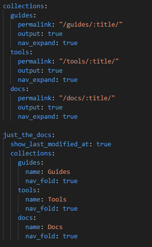
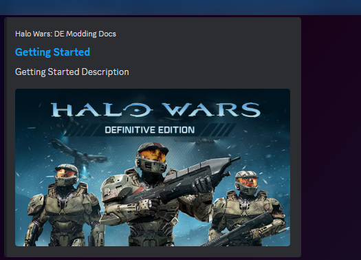

# Contributing to programming-pages

## Guidelines

Contributions are welcome in the form of useful [pull requests](https://help.github.com/articles/creating-a-pull-request/) that do one of the following:

1. Correct a typo or provide clearer wording
1. Add missing information that will make things easier to understand
1. Identify a bug and the steps to reproduce it
1. Produce a bug fix or performance improvement
1. Implement a useful new feature

## A Contributor's Guide

If you're eager to contribute to our documentation, it's essential to understand how the architecture operates. Follow these steps to ensure smooth integration:

### Understanding the Architecture

First, familiarize yourself with the core components:


- `_docs`, `_guides`, and `_tools` are known as `collections`, which can store `pages`.

### Adding a Collection

1. **Create a Collection Folder**: Decide on the name for your collection folder, such as `examples`. Prefix the folder name with an underscore (`_`).

2. **Update `_config.yml`**: Navigate to the `_config.yml` file. Be cautious not to alter any unrelated settings.

   

   Scroll down to the `collections` properties and append your collection name, `examples`, at the end.

   ```yml
   examples:
     permalink: "/examples/:title/"
     output: true
     nav_expand: true
   ```

### Adding a Page

1. **Create a Markdown File**: Name your file according to this structure: `[Collection]_[Order]_[Name].md`, for example, `examples_01_contributing.md`.

2. **Set Metadata**: Add the following header to your markdown file:

   ```yml
   ---
   title: Contributing
   description: Contributing Description
   permalink: /examples/contributing
   layout: default
   nav_order: 1
   image: https://raw.githubusercontent.com/halowarsmodding.github.io/master/resources/images/metadata/header.png
   toc: true
   ---
   ```

   Ensure the metadata is correctly filled:
   - `title`, `description`, and `image` are crucial for URL embedding, providing a visual preview when sharing the link.
   - `permalink` specifies the collection under which the page should appear and its name.
   - `nav_order` determines the page's order within the navigation.
   - `toc` enables a table of contents for easier navigation within the page.

        

By following these steps, you'll seamlessly integrate your contributions into our documentation!


## Code of Conduct

This project and its participants are governed by the project's [Code of Conduct](CODE_OF_CONDUCT.md). By participating, you are expected to uphold this code.